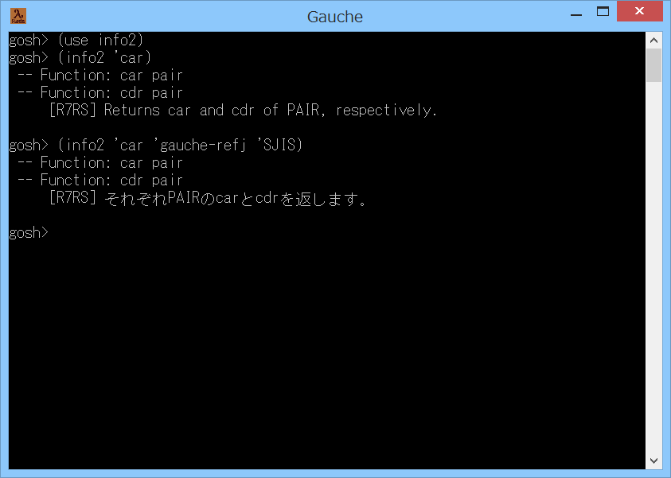

# info2



## 概要
- Gauche で info 手続きを拡張した info2 手続きを使用可能にするためのモジュールです。  
  標準の info 手続きは、検索する infoファイル名が gauche-refe.info に固定となって  
  いますが、info2 手続きは、検索する infoファイル名を 指定することができます。


## インストール方法
- info2.scm を Gauche でロード可能なフォルダにコピーします。  
  (例えば (gauche-site-library-directory) で表示されるフォルダ等)


## 使い方
```
  (use info2)                     ; モジュールをロードします
  (info2 'car)                    ; car 手続きの説明を英語で表示します
  (info2 'car 'gauche-refj 'SJIS) ; car 手続きの説明を日本語のシフトJISで表示します
```
- info2 手続きの書式は以下の通りです。  
  `info2  name  [file]  [ces1]  [ces2]  [cache-reset]`
  - 第1引数の name には、調べたい手続きの名前をシンボルか文字列で指定します。

  - 第2引数の file には、infoファイルの名前をシンボルか文字列で指定します。  
    このとき、ファイル名の末尾の .info または -refe.info は省略可能です。  
    また、第2引数全体も省略可能です。省略した場合には gauche-refe.info が  
    読み込まれます。

  - 第3引数の ces1 には、出力する説明文の文字エンコーディングを指定します。  
    例えば、Windowsのコンソールに日本語を出力する場合には 'SJIS を指定してください。  
    第3引数に #f を指定すると、文字エンコーディングは未指定になります。  
    また、第3引数は省略可能です。省略した場合には #f を指定したことになります。

  - 第4引数の ces2 には、検索結果が複数存在する場合に出力するセクション名の  
    文字エンコーディングを指定します。  
    第4引数に #f を指定すると、文字エンコーディングは未指定になります。  
    第4引数に #t を指定すると、文字エンコーディングは ces1 と同じものになります。  
    また、第4引数は省略可能です。省略した場合には #t を指定したことになります。

  - 第5引数の cache-reset には、キャッシュをリセットするかどうかを指定します。  
    すでに読み込んだ infoファイルは、キャッシュに保存され高速検索が可能になりますが、  
    本引数に #t を指定すると、キャッシュを破棄してファイルを再読み込みします。  
    第5引数は省略可能です。省略した場合には #f を指定したことになります。


## 注意事項
1. 本モジュールは、gauche.interactive.info をベースに改造しました。  
   また、内部で text.info モジュールの定義をいくつか上書きしています。  
   このため、Gauche の将来のバージョンアップで動かなくなる可能性があります。

2. Gauche の infoファイルの格納先は、以下のコマンドで確認可能です。  
   `gauche-config --infodir`

3. 検索する infoファイルには、手続きの索引のノードがある必要があります。  
   そして、そのノード名が、info2.scm 内の `*index-node-name*` の項目のいずれかと  
   一致している必要があります。

4. Gauche v0.9.5_pre1 で info 手続きの仕様が変わり、指定した手続きの説明のみを  
   表示するようになりました。  
   これに追従して info2 手続きも、v0.9.5_pre1 以後で可能な場合には、  
   指定した手続きの説明のみを表示するようにしました。  
   以前と同様に章全体を表示したい場合には、info2-page 手続きを使用してください。  
   info2-page 手続きの書式は、info2 手続きと同様です。

5. 例えば `(info2 'if)` のように 検索結果が複数存在する項目については、  
   対応する各セクション名が表示されます。  
   そこで、番号を入力すると、選択したセクションの説明文が表示されます。  
   (Gauche v0.9.5_pre1 で追加された機能)

6. v1.11 で、環境変数 PAGER の値を毎回チェックするようにしました。  
   例えば、Windowsの場合には、
   ```
     (sys-setenv "PAGER" "more.com" #t)
   ```
   を実行すると、info2 手続きで1画面表示するごとに、キー入力を待つようにすることができます。  
   (ただし、Windows の more.com コマンドは、シフトJIS 以外の文字コードを、  
   正常に表示できないので注意してください)  
   (上記 sys-setenv の第3引数は、上書きの指定です。(忘れやすいので注意))

7. 現状、Gauche v0.9.5_pre1 以後の info 手続きにある以下の機能については、未対応です。
   - 検索結果が存在しなかった場合に、類似候補を表示する機能  
     (Gauche v0.9.5_pre1 で追加された機能)
   - 検索結果が複数存在した場合に、同一のセクション名のものを1件にまとめる機能  
     (Gauche v0.9.6_pre2 で追加された機能)


## 環境等
- OS
  - Windows 8.1 (64bit)
- 言語
  - Gauche v0.9.5
  - Gauche v0.9.4

## 履歴
- 2015-8-26  v1.00 (初版)
- 2015-8-26  v1.01 コメント修正のみ
- 2015-8-27  v1.02 コメント修正のみ
- 2015-8-27  v1.03 文字列補完を暫定で旧形式に統一
- 2015-8-27  v1.04 不要なcond-expandを1個削除
- 2015-8-29  v1.05 cond-expandを元に戻した  
  (Windowsではsys-isattyは変換ポートが入ると #t にならない)
- 2015-9-7   v1.06 Gaucheの開発最新版に暫定対応
- 2015-10-11 v1.07 Gauche v0.9.5_pre1 の info 手続きの仕様変更に対応
- 2015-10-20 v1.08 ヘッダー表示の不具合修正(例えば (info2 'set!) 等)
- 2015-10-21 v1.09 コメント修正のみ
- 2015-12-17 v1.10 gauhe-al-refe.infoに対応
- 2015-12-19 v1.11 Windowsのときにデフォルトでmore.comコマンドを使うのをやめた。  
  環境変数PAGERの値を毎回チェックするようにした
- 2015-12-21 v1.12 コメント修正のみ
- 2016-1-1   v1.13 makeinfo v6.0 で索引の行番号が-1されている件に対応
- 2016-4-14  v1.14 Gauche v0.9.5_pre1 の更新に一部追従  
  (複数項目の選択機能。モジュール,クラス,変数索引の追加等)
- 2016-4-14  v1.15 第4引数の定義を修正
- 2016-4-15  v1.16 コメント修正のみ
- 2016-5-7   v1.17 formatの引数見直し
- 2016-10-27 v1.18 Gauche v0.9.5 の更新に一部追従等
- 2016-10-28 v1.19 コメント修正等
- 2017-8-20  v1.20 Gauche v0.9.6_pre2 の更新に一部追従等


(2017-8-20)
