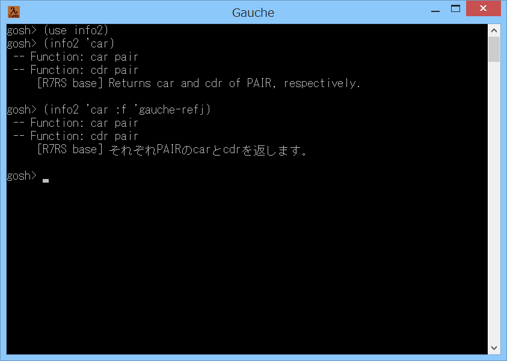

# info2



## 概要
- Gauche で info 手続きを拡張した info2 手続きを使用可能にするための  
  モジュールです。  
  標準の info 手続きは、検索する infoファイル名が gauche-refe.info に固定となって  
  いますが、info2 手続きは、検索する infoファイル名を 指定することができます。


## インストール方法
- info2.scm を Gauche でロード可能なフォルダにコピーします。  
  (例えば (gauche-site-library-directory) で表示されるフォルダ等)


## 使い方
```
  (use info2)                     ; モジュールをロードします
  (info2 'car)                    ; car 手続きの説明を英語で表示します
  (info2 'car 'gauche-refj 'SJIS) ; car 手続きの説明を日本語のシフトJISで表示します
```
- info2 手続きの書式は以下の通りです。  
  `info2  name  [file]  [ces]  [cache-reset]`
  - 第1引数の name には、調べたい手続きの名前をシンボルで指定します。
  - 第2引数の file には、infoファイルの名前をシンボルで指定します。  
    このとき、ファイル名の末尾の .info または -refe.info は省略可能です。  
    また、第2引数全体も省略可能です。省略した場合は gauche-refe.info が  
    読み込まれます。
  - 第3引数の ces には、出力する文字のエンコーディングを指定します。  
    例えば、Windowsのコンソールに日本語を出力する場合は 'SJIS を指定してください。  
    第3引数に #f を指定すると、エンコーディングは未指定になります。  
    また、第3引数は省略可能です。省略した場合は #f を指定したことになります。
  - 第4引数の cache-reset には、キャッシュをリセットするかどうかを指定します。  
    すでに読み込んだ infoファイルは、キャッシュに保存され高速検索が可能になりますが、  
    本引数に #t を指定すると、キャッシュを破棄してファイルを再読み込みします。  
    第4引数は省略可能です。省略した場合は #f を指定したことになります。


## 注意事項
1. 本モジュールは、gauche.interactive.info をベースに改造しました。  
   また、内部で text.info モジュールの定義をいくつか上書きしています。  
   このため、Gauche の将来のバージョンアップで動かなくなる可能性があります。

2. Gauche の infoファイルの格納先は、以下のコマンドで確認可能です。  
   `gauche-config --infodir`

3. 検索する infoファイルには、手続きの索引のノードがある必要があります。  
   そして、そのノード名が、info2.scm 内の `*index-node-name*` の項目のいずれかと  
   一致している必要があります。


## 環境等
- OS
  - Windows 8.1 (64bit)
- 言語
  - Gauche v0.9.4

## 履歴
- 2015-8-26  v1.00 (初版)
- 2015-8-26  v1.01 コメント修正のみ
- 2015-8-27  v1.02 コメント修正のみ
- 2015-8-27  v1.03 文字列補完を暫定で旧形式に統一
- 2015-8-27  v1.04 不要なcond-expandを1個削除
- 2015-8-29  v1.05 cond-expandを元に戻した  
  (Windowsではsys-isattyは変換ポートが入ると #t にならない)
- 2015-9-7   v1.06 Gaucheの開発最新版に暫定対応


(2015-9-7)
